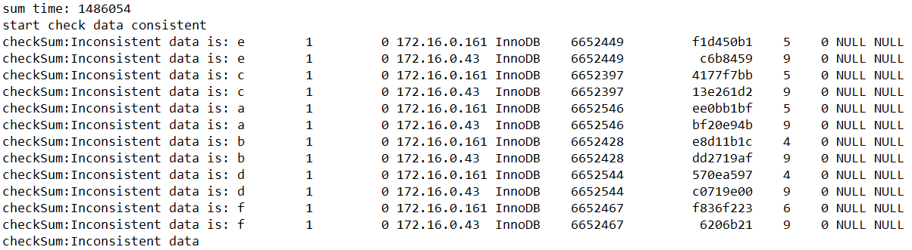
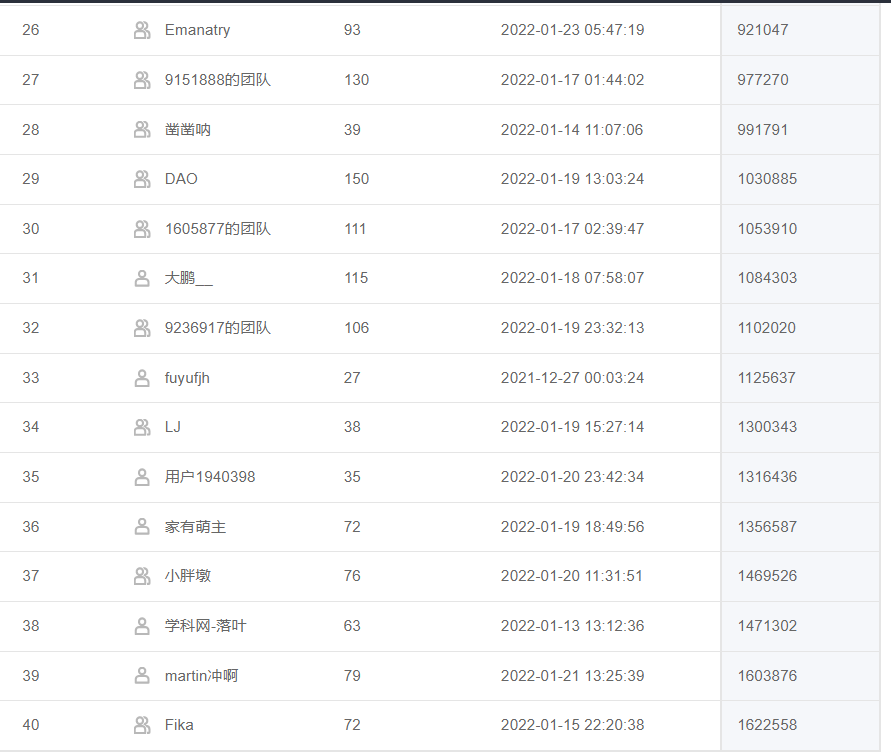

# TDSQL数据迁移

本次赛题以数据迁移来实现多合一数据归档为切入，实现一个具有分布式TDSQL多源合并能力的迁移程序，支持存量和增量数据迁移，首先需要保证数据的正确性，同时具备鲁棒性和好的性能。

这个测试集一共是50GB左右，28个表，每个表不重复的量不到1000w的数量级

## 结果和总结

### 结果



我的最好的结果是能跑到1486054ms，但是最后无论怎么试，就是第一组无法通过，不知道是浮点数的问题，还是其他问题，但是在本地跑的话，
导入MYSQL数据库的导入结果和MySQL数据库自带的load data命令的crc校验值是一样的，不知道问题出在哪。

### 总结

这个竞赛中用到了多个别人开源或者闭源的工具（只有mysql-connector-java-8.0.27.jar是闭源的）
在21号才明白这个项目的解决方案。可惜23号截止前还是没能得出正确答案

#### 一开始的方案

首先我分析了一波在本地利用Hash去重的代价，结果发现，如果官方提及表的大小为10亿的话，在本地去重是不可能实现的（但是数据量的话，最后发现每个表只有最多900w的不重复的项，是可以在本地处理的）。

所以一开始采取的在本地利用布隆过滤器来实现对数据的初步过滤，如果出现了重复数据，再先数据库发送请求，查询是否存在数据，以及该数据的updated_at和数据库中存储的数据的更新时间的比较

但是后面对查询的过程进行分析（由于查询不适用batch形式查询，只能使用单次查询，这就导致了去重耗费的时间成本非常大）。我自己在本地测试（测试的笔记本配置是i7 8250u 8G，服务器是阿里云的2核4GB内存的服务器，之间的ping的延迟大概20ms左右吧）
执行1000次查询耗时大概在32000ms左右，肯定不能用这种方式去去重，效率低，耗时长。即使插入线程开启到了16，插入耗时也远在6000 000ms以上。

#### 最后优化的方案

后面想起来在完全在本地完成去重的任务。
主要涉及的对象主要是：
- RowEntity对象用来存储行数据，以及flag是否被标记过了

- PriorityQueue来进行第二次回写的时候判断是否更新第一次写入的数据

- HashMap 来分辨是否存在重复对象，存储数据（HashMap<String, RowEntity>）


1. 对每个数据库的每个表进行单独处理（每个表的源文件有多个）
   1. 读取每行，并且获取该行的hash值（hash值通过该表的索引来确定）
   
   2. 如果HashMap含有hash值，则比较它们的updated_at来确定是否更新这行，如果要更新的话，在通过之前的flag来判断是否放入了PriorityQueue中
      如果不要更新的话直接写入文件1

2. 对文件1进行处理，依次读取每行，并且记录当前读取的行数
   1. 如果当前行数和PriorityQueue中的peek相等的话，就写入hashMap中的值，否则写入从文件1读取的行

经过上面两大步操作，已经去除了重复的行（并且也通过updated_at的值来决定是否更新了）
后面的batch insert就可以很舒畅的进行了！


## 计划与时间安排 12.16 - 1.18

8个数据源 - 库 - 表

50G数据

扫描全部的数据源，找到每个数据源中对应的数据库，
对每个相对应中的数据库的表建立索引，记录他们的表定义字符串，表数据的位置。
对每个数据库依次执行插入操作。

## 相应的分类以及其功能
Entity：一些实体类的定义，例如

1. 数据库实例

2. 数据表实例

   解析SQL语句，

Service:

1. 一些服务代码的编写

2. DBManager：

   1. getDBList：（程序开始时启动）负责搜索给定文件目录下各个源的database，找出相同的database下面有的相同的表，并且用MAP去索引他们database，然后每个database目录下面表格利用list去记录每个table示例。

      **注意去重和精度问题**

   2. createDBaTB：在开始时候调用，负责创建数据库和每个数据库下的表。

   3. insert2TB：向每个表插入数据

3. DBConnection：管理连接的一些服务基于JDBC & Mybatis

3. Thread: 实现线程池的管理

## 具体过程（待修改

### 每个线程干的活

1. ~~为所有的数据库源文件建立index~~

2. ~~按照数据库的顺序去一个个插入~~ 


1. 每个线程负责一个数据库，所以不会存在线程冲突的情况。（第一种方案）

   或者将每个线程负责每个表的插入？这样能不能实现资源的最大利用？（第二种方案）

### 多线程版本

1. 对应给定机器的核心数目，来确定线程的数目。

2. 并行对不同的库进行插入，插入的过程和单线程版本相同

3. we should insert by table, it is slow to insert by database.

## 注意的问题

1. 相同库下的相同的表的相同的列，可能存在表的精度不一致的情况，要取大的精度作为新的表格。 **建表语句字段的精度不够会导致导入的数据与文件的数据不一致，但和同结构的表里的数据是一致的。不同的比较方式会有不同的比较结果。**

   解决方案：对于每一个不同的表，都解析出他们的列，然后对于

## 程序可能存在的漏洞

1&2都是官方没有给出明确的比较精度更新条件可能导致的情况

1. 在compareColumnType的对于SQLNumberType的比较里面我没有对Decimal的情况进行特判，因为DECIMAL(M, N) 可能会比BIGINT 或者是DOUBLE精度更小的情况。**如果出现了导入数据不一致的情况，对这个判断进行修改** （默认选用了DECIMAL就会储存比BIGINT或者DOUBLE更大的整数）

   **DECIMAL 如果总长度小于等于M，但是小数点的位数超过了N会导致超过精度后的数字被删除！这不会影响插入的结果**

   ```mysql
   create table `a`(
   	id char (32) NOT NULL DEFAULT "9999" primary key,
   	par1 INTEGER default 10,
   	par2 DECIMAL(10, 5) default 10.9
   );
   
   INSERT into a values ('18', 1, 12345.11111111111111111);
   -- 数据库中的结果 12345.11111
   ```

   

2. 在compareColumnType的对于同为DECIMAL的比较我采用了选择使用M大的（可能需要选择N大的来保证小数点精度）

## 开发过程中的疑问

1. 对于之前提到的**精度**问题，如果char(5) varchar(5)应该选择哪一个？或者说直接用第一个遇到的就可以，但是这样系统使用checksum来判断的，checksum会判断表的定义么，那么如果系统选择的是varchar而不是char那不是错了？

   **我先采用字符串类型长度一致就如果两者里面由varchar 就使用varchar否则使用char （1/3）**
   
2. 我想利用Map去重然后加速插入 如何计算大小呢？[100 W 的HashMap<Integer, Integer> ](https://blog.csdn.net/qq_27657429/article/details/81264666) 大概占用69MB（实际上数据大概是32MB左右，但是存在索引和本身的一些数据结构）

   **如果我只算Integer的16 * 10 ^ 9，基本可以考虑不用这个了，已经操作了，光只算Set去完成去重的结构，那么只能依靠数据库的查询去完成去重任务**

   题目中提到总共的表的数据不会超过10亿 （10^9）,那么用string做索引的话，假设两段字符串长度为总共为20，一个char类型为2字节，40 bytes * 10^ 9 ~ 40 GB, 肯定超过内存容量了。

   如果prime key是为数字类型的话，是可以利用数字类型作为Map的值去作为去重的依据


## 开发中遇到的问题

1. 创建数据库遇到的问题

   我想使用PreparedStatement 去创建数据库，他提供了可替换选项，但是结果是preparedstatement会在我传递过去的值两端加上‘’，导致插入无法成功 原因是prepared statement只支持值的修改，不应该在表名上修改。[连接](https://stackoverflow.com/questions/26582722/unable-to-create-database-using-prepared-statements-in-mysql) 在创建表和数据库的时候preparedstatement没有优势，实际上应该利用statement来完成创建任务。

   ```java
   String dbName = "first_database";
   Statement createDbStatement = connection.createStatement();
   createDbStatement.execute("CREATE DATABASE " + dbName);
   ```

   ```mysql
   -- create 语句示例
   CREATE TABLE if not exists `1`  (
     `id` bigint(20) unsigned NOT NULL,
     `a` float NOT NULL DEFAULT '0',
     `b` char(32) NOT NULL DEFAULT '',
     `updated_at` datetime NOT NULL DEFAULT '2021-12-12 00:00:00',
     PRIMARY KEY (`id`)
   ) ENGINE=InnoDB DEFAULT CHARSET=utf8
   
   -- insert 语句示例
    INSERT INTO table_name values (column1, column2, column3, ...)
   ```
   
   
   
2. Create statement 的最后一个变量声明的末尾不应该包含逗号。。

## 可能可以优化的点
1. float实际精度只有6位

## 项目中使用到的一些JAVA开源 / 非开源库 （感谢这些开源库 / 非开源库）

[mysql connector](https://dev.mysql.com/downloads/connector/j/) ：用来完成对数据库的连接（**非开源库**， 这个应该是没有开源的）

[HikariCP](https://github.com/brettwooldridge/HikariCP) ：数据库的连接池

[SLF4J](https://www.slf4j.org/) ：记录日志

[JUnit5](https://junit.org/junit5/) ：用来完成单元测试

[JSqlParser](https://github.com/JSQLParser/JSqlParser) : 解析create table statement由于在这个要求中，每个不同源的数据库可能存在表的列精度不一致的情况，为了解决这个问题，需要对SQL create statement进行解析获得不同列的不同的数据精度，然后依据精度情况对其进行更新