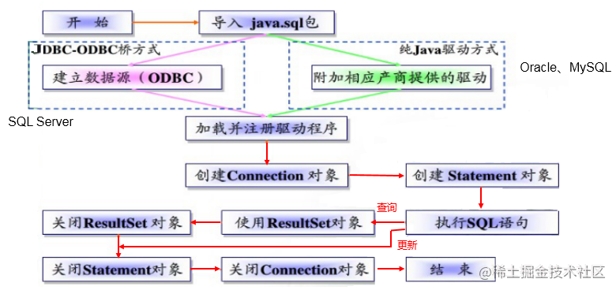

## JDBC

- JDBC是是一个**独立于特定数据库管理系统、通用的SQL数据库存取和操作的公共接口**（一组API），定义了用来访问数据库的标准 Java 类库，（**java.sql,javax.sql**）使用这些类库可以以一种**标准**的方法、方便地访问数据库资源。
- DBC 为访问不同的数据库提供了一种**统一的途径**，为开发者屏蔽了一些细节问题。
- JDBC 的目标是使Java程序员使用 JDBC 可以连接任何**提供了JDBC驱动程序**的数据库系统，这样就使得程序员无需对特定的数据库系统的特点有过多的了解，从而大大简化和加快了开发过程。

### 体系结构

- 面向应用API：供开发人员使用
- 面向数据库API：宫开发商开发数据库驱动程序使用



### 获取数据库连接

1. 加载驱动（Driver接口实现类）

   ```java
   static {
       try{
           Class.forName("com.mysql.cj.jdbc.Driver");
       }catch (ClassNotFoundException e){
           e.printStackTrace();
       }
   }
   ```

2. ```java
   jdbc:mysql://主机名称:mysql服务端口号/数据库名称?参数=值&参数=值
   ```


## 使用PreparedStatement 实现CRUD操作

### 操作和访问数据库

- 数据库连接被用于向数据库服务器发送命令和 SQL 语句，并接受数据库服务器返回的结果。其实一个数据库连接就是一个 Socket 连接。
- 在 java.sql 包中有 3 个接口分别定义了对数据库的调用的不同方式：
   - Statement：用于执行静态 SQL 语句并返回它所生成结果的对象
   - PrepatedStatement：SQL 语句被预编译并存储在此对象中，可以使用此对象多次高效地执行该语句
   - CallableStatement：用于执行 SQL 存储过程

### 最好利用PreparedStatement来操作

但是PlreparedStatement也存在相应的问题，不是对create使用的，是对insert等操作使用的

## 一些疑问

1. 当我存在创建table的需求的时候，如何确定我当前连接是位于哪一个数据库呢？当我执行create table statement，如何设置在哪个数据库创建。（这个项目是需要在未指定的JDBC连接的条件下运行的）
2.  如何

## 开发中遇到的问题

1. 当我复用利用connection.setCatalog(DatabaseName)已经设置了数据库的时候，在利用statement去执行创建新的数据库命令的时候就会出错。每次创建完新的数据库都要关闭连接然后新建立一个链接


[JDBC学习指南 IOWIKI](https://iowiki.com/jdbc/jdbc-quick-guide.html) 

[JDBC 乐天笔记](https://www.letianbiji.com/jdbc/jdbc-create-db-and-table.html) 

https://juejin.cn/post/6965271621204443167

https://www.runoob.com/w3cnote/jdbc-use-guide.html

https://blog.csdn.net/yuzhiqiang_1993/article/details/115416342
